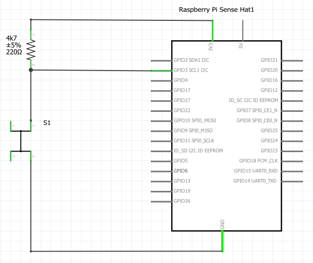

# SYSC3010 Lab4
This repository was created for Lab4 of SYSC3010 course from Carleton University. The main goal is to use git as a Team, where each student changes files in their own branches and then merge their files in the main branch when new features are implemented.

# What does it do?
It allows ```users``` to remotely set the LED colors from the sense hat attached to a ```device``` (RPi).

The [backend.py](backend.py) script has the ```Lab4db()``` class, which contains all the operations related to the database. For example setting up users, devices, and configurations, as well as setting up the LEDs colors. It uses the configuration file (```mydbconfig.py```) to set and get values from the firebase database.

The [frontend.py](frontend.py) script can be run on your own computer and is responsible to provide a GUI implemented using [dash](https://dash.plotly.com/). It also needs the database and user configuration file (```mydbconfig.py```). When you execute the [frontend.py](frontend.py) file, a [flask](https://flask.palletsprojects.com/en/2.0.x/) server runs in the background. So the GUI can be accessed from your local network through the address ```<device_ip>:8050```, where ```device_ip``` is the ip of the device where the [frontend.py](frontend.py) is being executed. This is how it will look like if accessed from your smartphone:

<p align="center" width="100%">
   
</p>

The [device.py](device.py) script is executed on your Raspberry pi. It also needs the database and user configuration file (```mydbconfig.py```). At the start, it gets all LED values from the database and update the sense hat pixels. It uses [firebase streams](https://github.com/nhorvath/Pyrebase4#streaming) to get any update from the database. In other words, whenever a user changes the LED color using the GUI then a message is received and the pixel is updated accordingly.

Note that the GUI can be run from anywhere and users can control authorized devices from their respective GUIs. The idea is that any one of your team mates can change the sense hat pixels of your RPi.

# Install
There are packages required for this code to work. You can install them manually (look at the [install.sh](install.sh) script) or just execute it on a terminal from your RPi:
```
./install.sh
```

# Config
To use the Firebase database, you need to setup a Firebase database as performed in Lab3. 
Considering that the database is up and running, you need to provide the configuration for the database, and for each user. A sample file can be found in [here](dbconfig.py). You should then copy the file
```
cp dbconfig.py mydbconfig.py
``` 
and edit its contents. The file should contain:
1. Your ```email```
2. Your ```firstname```
3. Your ```lastname```
4. The firebase configuration ```config```

> These variables are used by many files and should be set for things to work properly.

# Hardware
One of the objectives of this lab is also adding new hardware to the RPi and sense hat. There is a mistake in the circuit provided that needs fixing. Only the png image of the circuit is provided. Students are required to provide the circuit file and update the figure with the correct connections.



# Deliverables

## Student #1
1. Fork the repository, **make it private, add your TA, the prof and your classmates**
2. Add collaborators (your group mates)

## Each student

### Setup
Once the database is setup and the mydbconfig.py is set, each student should run the (device.py)[device.py] so that their device is registered on the database.

The device (RPi) will be registed under the user configuration. But, each student should give authorization to their groupmates to control his device. You can do that by running these commands in python from your RPi:
```
from backend import Lab4db
from mydbconfig import *
db = Lab4db(config, email, firstname, lastname)

# Add each of your group mates
db.add_authorized_users('my_group_mate_email@cmail.carleton.ca' )
```

### GitHub and git tasks
1. Open at least 3 issues and assign a label to it
2. Self-assign 3 issues
3. Create a new branch to work on the assigned issues
4. Commit your changes to your current branch
5. Once the code reflect the solutions, merge with the main branch and resolve the issue.

### Issues
1. Create the schematic circuit using Fritzing and upload it to the [hardware](hardware) folder.
2. Upload the updated [schematic image of the external button](images/external_button.png).
3. Create a function to check when a button is pressed, and when pressed call the function ```upload_pressure()``` in the (device.py)[device.py] file.
4. Edit the function ```update_graph()``` to update the figure every 5 seconds in the [frontend.py](frontend.py) script.
5. Edit the function ```get_pressure_data(deviceid)``` to retrieve the pressure points from the database in the [backend.py](backend.py) script.
   - should return a pandas dataframe with datetime as index and pressure as column
7. Edit the function ```set_pressure_data(pressure)``` to upload the pressure data to the database in the [backend.py](backend.py) script..
8. Modify the README.md file to describe what this projects does, including nice images.
9. Take nice screenshots from the project and add to the [images](images) folder.
